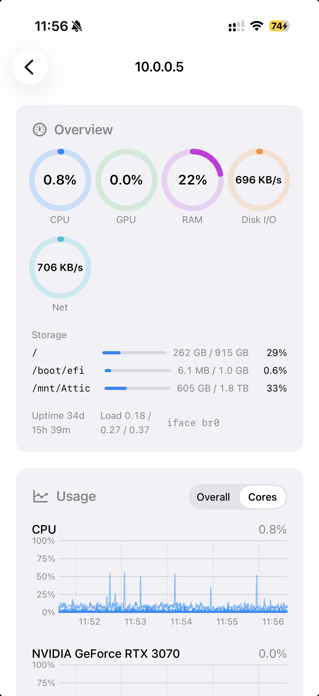
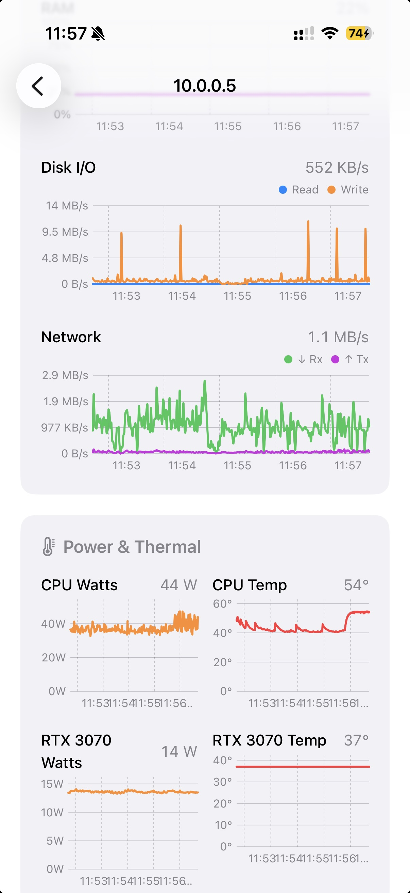
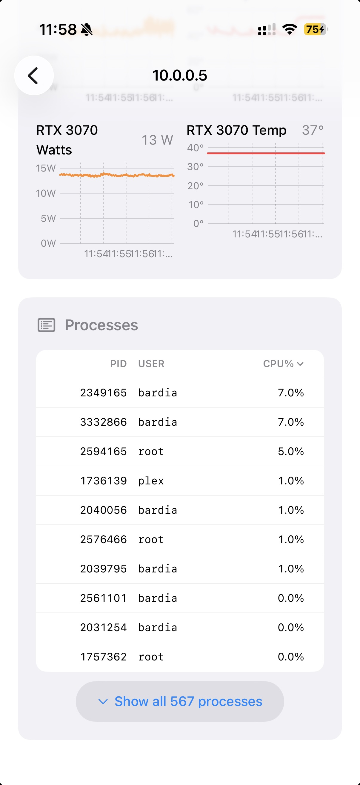

# PocketTop

> A pocket-sized view of what your machines are doing — and a way to act on it.

PocketTop is an iOS app for checking on and acting on personal and homelab machines. Live CPU / GPU / memory / disk / network. The hottest processes. Tap to kill one. Close the app and get on with your day.

It sits between observation-only tools (iStat, Glances) and heavyweight RMM stacks (Pulseway, Site24x7) — for people who own their machines personally, not fleets.

Full product pitch → [`docs/Executive Summary.md`](docs/Executive%20Summary.md).

## Status

- **Linux monitored hosts:** shipped end-to-end — SSH install → systemd agent → HTTPS pinned polling → process kill.
- **Windows monitored hosts:** planned, see [`docs/Windows_Implementation.md`](docs/Windows_Implementation.md).
- **macOS monitored hosts:** future.
- **iOS client:** the only client for now. Web is future.

## Screenshots

<p align="center">
  
  
  
</p>

## How it works

```
┌──────────────┐    SSH (22)         ┌─────────────────────────────┐
│  iOS App     │ ──── setup/admin ──►│  Linux host                 │
│  (SwiftUI)   │                     │                             │
│              │    HTTPS (443)      │  pockettopd (systemd)       │
│  MetricsSvc  │ ◄──── pinned ──────►│  - GET /snapshot            │
│  (URLSession)│    self-signed TLS  │  - POST /processes/{pid}/kill│
└──────────────┘                     │  - reads /proc, /sys        │
                                     └─────────────────────────────┘
```

SSH is used once — to install a tiny Go agent (`pockettopd`) and capture credentials. After that the app talks to the agent over cert-pinned HTTPS. No sudo at steady state.

Deeper architecture: [`docs/SSH_App_Architecture_Reference.md`](docs/SSH_App_Architecture_Reference.md) and [`docs/Linux_Implementation.md`](docs/Linux_Implementation.md).

## Build

Requires Xcode 16+ on macOS.

```bash
# Open in Xcode
open PocketTop/PocketTop.xcodeproj

# Or build from the CLI
xcodebuild -project PocketTop/PocketTop.xcodeproj -scheme PocketTop \
  -destination 'platform=iOS Simulator,name=iPhone 16' build
```

Dependencies (Citadel for SSH) are declared in the Xcode project, no SPM manifest at the repo root.

## Build the agent

The `pockettopd` Go binary is bundled into the iOS app at `PocketTop/PocketTop/Resources/pockettopd-linux-{amd64,arm64}`. To rebuild:

```bash
cd server/pockettopd
make build-all      # writes dist/pockettopd-linux-{amd64,arm64}
# Copy into Resources/ if you want the iOS app to ship fresh binaries:
cp dist/pockettopd-linux-amd64 ../../PocketTop/PocketTop/Resources/
cp dist/pockettopd-linux-arm64 ../../PocketTop/PocketTop/Resources/
```

Requires Go 1.22+. Pure Go, no cgo, cross-compiles from any host.

## Adding a monitored Linux host

From inside the app:

1. Tap **+** on the home screen.
2. Enter SSH host / port / username.
3. Pick password or SSH-key auth.
4. Confirm the host-key fingerprint.
5. Watch the install stream — the app uploads the agent, runs the installer, and captures the API key + TLS fingerprint.
6. The machine appears on the home screen. Tap to see live metrics.

The remote machine needs:
- SSH access (port 22 by default).
- sudo (or root) for the install step only.
- Ability to listen on TCP 443 (the installer opens `ufw` if present).
- systemd (Debian / Ubuntu / Fedora / Arch — anything modern).

## Docs

- [`docs/Executive Summary.md`](docs/Executive%20Summary.md) — what PocketTop is and is not.
- [`docs/SSH_App_Architecture_Reference.md`](docs/SSH_App_Architecture_Reference.md) — SSH + install + TLS + reconnect patterns.
- [`docs/Linux_Implementation.md`](docs/Linux_Implementation.md) — how the shipped Linux support is built.
- [`docs/Windows_Implementation.md`](docs/Windows_Implementation.md) — plan for Windows host support.

## Contributing

See [CONTRIBUTING.md](CONTRIBUTING.md).

## License

GPL-3.0. See [LICENSE](LICENSE).
